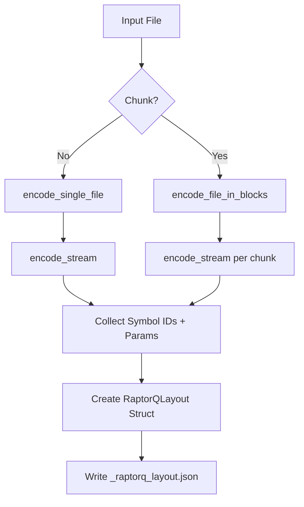
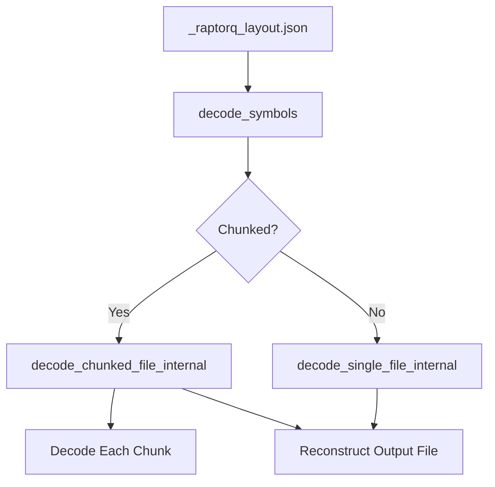

# RQ Redesign: From Memory-Intensive Service to Efficient Multi-Platform Library

## 1. Original Architecture and Problem Statement

### 1.1 Service-Based Architecture

Our original implementation consisted of two backend services:

- **Supernode** (Go): User-facing service receiving files and requests
- **RQ-Service** (Rust): Specialized gRPC server wrapping the RaptorQ erasure coding library

Workflow:

1. Supernode received files and stored them
2. Supernode invoked RQ-Service over gRPC
3. RQ-Service loaded entire files into memory
4. Applied RaptorQ encoding
5. Symbols were written to a disk subdirectory

### 1.2 Critical Memory Issues

This architecture suffered from severe RAM-related issues:

- **Full File Loading**: Entire files loaded via `read_to_end()`
- **Concurrent Requests**: Multiple large files exhausted memory
- **No Throttling**: No limits on simultaneous work or memory usage
- **OOM Killer Triggered**: Service instability

## 2. New Design: Multi-Target Stream-Based Library with Chunked Metadata

### 2.1 Architectural Transformation

We replaced the gRPC RQ-Service with a library compiled for multiple targets:

- **RQ-Library**: Core encoding/decoding logic
- **Direct Integration**: Linked into the Supernode or other clients
- **Internal Resource Control**: Callers manage threading and memory

### 2.2 Key Features and Design Principles

1. **Chunked Stream Processing**: Only process file fragments in memory
2. **Built-in Resource Management**: Explicit concurrency/memory caps
3. **Cross-Platform Support**: Targets include desktop, mobile, WebAssembly
4. **Flexible FFI**: C ABI for native integration + WASM

## 3. Chunked Metadata File Format

To enable precise decoding of chunked files, the encoder emits a metadata file `_raptorq_layout.json` in the output directory. It contains the encoder parameters and full layout description.

### 3.1 Metadata Structure (Rust)

```rust
pub struct RaptorQLayout {
    pub encoder_parameters: Vec<u8>,
    pub blocks: Option<Vec<BlockLayout>>,
    pub symbols: Option<Vec<String>>,
}

pub struct BlockLayout {
    pub block_id: String,
    pub original_offset: u64,
    pub size: u64,
    pub symbols: Vec<String>,
}
```

### 3.2 Example (JSON: Chunked)

```json
{
  "encoder_parameters": [/* 12 bytes */],
  "blocks": [
    { "block_id": "chunk_0", "original_offset": 0, "size": 102400, "symbols": ["hash1", "hash2"] },
    { "block_id": "chunk_1", "original_offset": 102400, "size": 97600, "symbols": ["hash3", "hash4"] }
  ],
  "symbols": null
}
```

### 3.3 Example (JSON: Unchunked)

```json
{
  "encoder_parameters": [/* 12 bytes */],
  "blocks": null,
  "symbols": ["hash1", "hash2", "hash3"]
}
```

## 4. Library API and Call Flow

### 4.1 Encoding Flow



### 4.2 Decoding Flow



## 5. Benefits and Results

### 5.1 Memory Efficiency

- **Chunked Processing** avoids peak memory usage
- **Controlled Concurrency**: Avoids OOM by applying limits

### 5.2 Simplified Architecture

- **Eliminated gRPC Layer**
- **Direct Linkable Library**
- **Cross-platform Targets**: Native and WASM support

### 5.3 Accurate Symbol Mapping

- **Metadata-preserved symbol identifiers and chunk sizes** ensure correct decoding

## 6. Future Directions

- **Refine Memory Estimation** heuristics for chunk sizing
- **GPU Acceleration** (if viable for symbol generation)
- **Parallel Decoding** support
- **Runtime diagnostics** for corrupted symbols or layout
- **Dynamic Configuration API** for memory tuning

