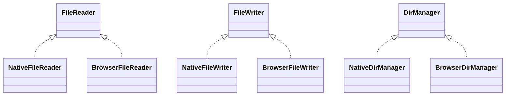

# Unified File I/O Abstraction Plan: FileReader, FileWriter, DirManager

## Overview

To enable robust, memory-efficient, and cross-platform file I/O for both native and browser/WASM targets, we will introduce new trait-based abstractions for reading, writing, and directory management. This will allow the rest of the codebase to use a consistent interface, regardless of platform, and will replace direct use of `std::fs` or ad-hoc JS async helpers.

---

## 1. Trait Definitions

```rust
pub trait FileReader {
    fn file_size(&self) -> Result<usize, String>;
    fn read_chunk(&self, offset: usize, length: usize) -> Result<Vec<u8>, String>;
}

pub trait FileWriter {
    fn write_chunk(&mut self, offset: usize, data: &[u8]) -> Result<(), String>;
    fn flush(&mut self) -> Result<(), String>; // Optional, for buffered writes
}

pub trait DirManager {
    fn create_dir_all(&self, path: &str) -> Result<(), String>;
}
```

---

## 2. Native Implementations

- **FileReader**: Wraps `std::fs::File`, uses `seek` and `read`.
- **FileWriter**: Wraps `std::fs::File`, uses `seek` and `write_all`.
- **DirManager**: Uses `std::fs::create_dir_all`.

---

## 3. Browser/WASM Implementations

- **FileReader**: Uses JS glue for `getFileSize(path)` and `readFileChunk(path, offset, length)`.
- **FileWriter**: Uses JS glue for `writeFileChunk(path, offset, data)` and `flushFile(path)`.
- **DirManager**: Uses JS glue for `createDirAll(path)`.

### WASM Bindings Example

```rust
#[wasm_bindgen(module = "/js/browser_fs.js")]
extern "C" {
    #[wasm_bindgen(js_name = getFileSize)]
    fn js_file_size(path: &str) -> u32;

    #[wasm_bindgen(js_name = readFileChunk)]
    async fn js_read_chunk(path: &str, offset: u32, length: u32) -> Uint8Array;

    #[wasm_bindgen(js_name = writeFileChunk)]
    async fn js_write_chunk(path: &str, offset: u32, data: &Uint8Array);

    #[wasm_bindgen(js_name = flushFile)]
    async fn js_flush_file(path: &str);

    #[wasm_bindgen(js_name = createDirAll)]
    async fn js_create_dir_all(path: &str);
}
```

### JS Glue Example (`browser_fs.js`)

```js
export function getFileSize(path) { ... }
export async function readFileChunk(path, offset, length) { ... }
export async function writeFileChunk(path, offset, data) { ... }
export async function flushFile(path) { ... }
export async function createDirAll(path) { ... }
```

---

## 4. Documentation

- These traits are to be used for all future file and directory I/O, replacing direct use of `std::fs` or JS async helpers.
- The processor and other logic can be refactored to use these traits in a future step.

---

## 5. Architecture Diagram



---

## 6. Migration Plan

- All changes are additive and isolated.
- No changes to `src/processor.rs` at this stage.
- The rest of the codebase can be refactored to use these traits in a future step.

---

**This document serves as the architectural plan for introducing unified file I/O abstractions across native and browser/WASM targets.**